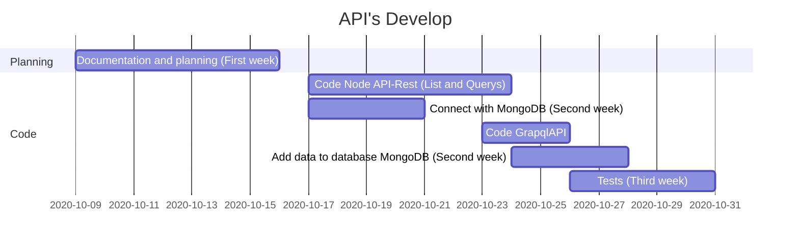

API
===

## Table of Contents

[TOC]

## General Description

News inc is an online newspaper that publishes news on a large scale every day (50-100 publications daily). This news is drawn from the world's leading newspapers and references each source accurately. It has 5 to 10 categories and each news has tags that identify it. It also has its own commenting system, so it has users with different roles (visitors, administrators, etc.).

## Folder Structure

Project Backend/Data Science Timeline
---

> Read more about the project here: https://www.notion.so/Team-master5-7-inc-News-Inc-project-7340af6d026b4eb8a3f0099888a890a6

## Technologies

* 
* 
* 
* 
* 
* 

##  Test

* 

##  Deploy and CI

* 
* 

### Libraries

* cors
* dotenv
* express-graphql
* graphql-tools
* swagger-ui-express
* nodemon
* standard

## Routes

* Api-Rest: http://backend-platzi-news.herokuapp.com/api/news
* Api-Graphql: https://backend-platzi-news.herokuapp.com/search
* Swagger-doc: https://app.swaggerhub.com/apis-docs/Jules.Cubs/News_inc/1.0.0

##  Architecture

